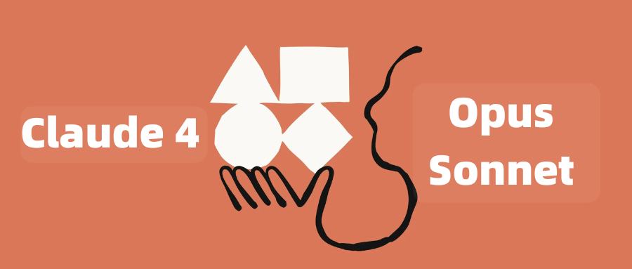
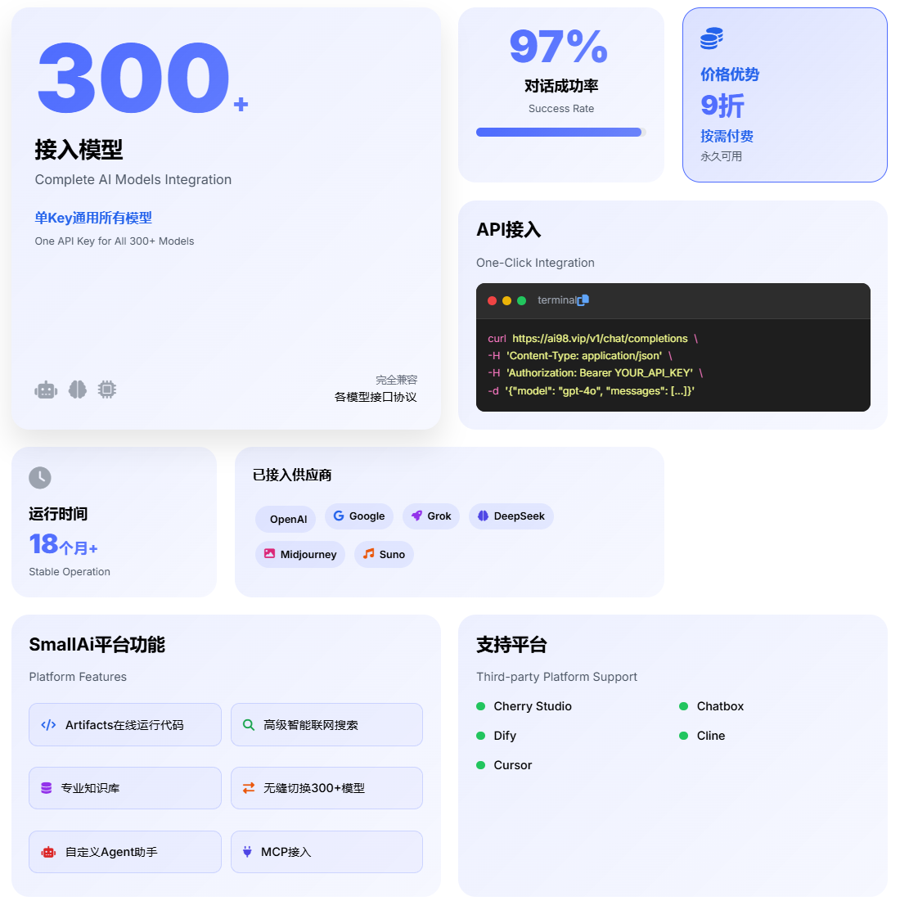
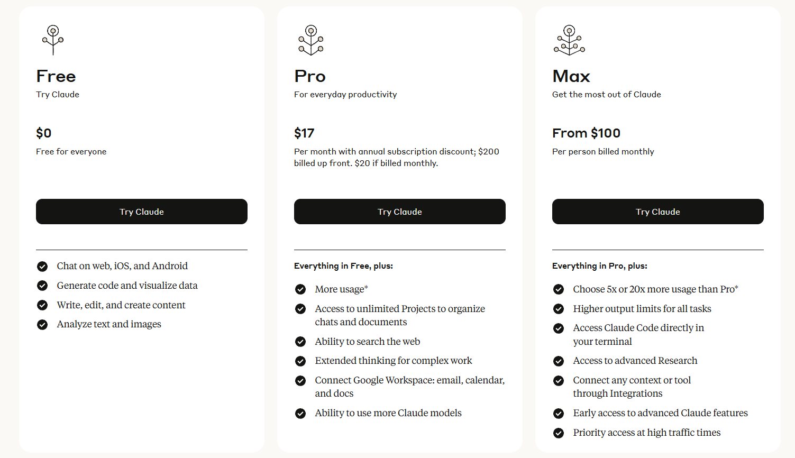

# Claude-4-API

🚀 **Claude 4 API 调用教程与代码示例**

本项目提供 Claude 4 Opus 和 Claude 4 Sonnet 模型的 API 调用教程，支持使用 OpenAI 格式进行调用，简单易用！

## 📋 目录

- [模型介绍](#模型介绍)
- [获取 API Key](#获取-api-key)
- [快速开始](#快速开始)
- [代码示例](#代码示例)
  - [基础对话](#基础对话)
  - [图像识别](#图像识别)
  - [高级功能](#高级功能)
- [模型对比](#模型对比)
- [常见问题](#常见问题)
- [更新日志](#更新日志)

## 🤖 模型介绍

### Claude 4 Opus (`claude-opus-4-20250514`)
- 🏆 **全球最佳编码模型**
- 💪 专注于复杂、长时间深度思考任务
- 📊 SWE-bench: 72.5% | Terminal-bench: 43.2%
- 🧠 支持扩展思考模式，可持续工作数小时
- 💰 定价：15/75 美元（每百万tokens 输入/输出）
- 💰 SmallAi 定价：13.5/67.5 美元（每百万tokens 输入/输出）
### Claude 4 Sonnet (`claude-sonnet-4-20250514`)
- ⚡ 高效平衡型模型
- 🎯 精准理解指令，快速响应
- 📈 相比 Sonnet 3.7 大幅提升
- 💰 定价：3/15 美元（每百万tokens 输入/输出）
- 💰 SmallAi 定价：2.7/13.5 美元（每百万tokens 输入/输出）

## 🔑 获取 API Key

### 方式一：SmallAi 平台（推荐）

1. **访问商城**：[https://shop.smallai.asia](https://shop.smallai.asia)
2. **选择额度**：建议从 $50 或 $100 开始
   > ⚠️ **重要**：请选择"全系列模型Key"，否则无法使用 Claude 系列模型
3. **填写信息**：
   - 电子邮箱：用于接收 SmallAI Key
   - 查询密码：用于查询 SmallAi Key
4. **获取密钥**：购买后检查邮箱，复制 `sk-xxxxxxxxxxxxxx` 格式的密钥

### 方式二：官方订阅

访问 [Anthropic 官网](https://www.anthropic.com/) 进行订阅：
- Pro: $17/月
- Max: $100/月  
- Team: $25/月
- Enterprise: 联系销售

> 💡 **提示**：国内用户推荐使用 SmallAi 平台，更稳定且价格优惠（官方9折）

## 🚀 快速开始

### 安装依赖

```bash
pip install openai python-dotenv
```

### 环境配置

创建 `.env` 文件：

```env
CLAUDE_API_KEY=sk-your-api-key-here
CLAUDE_BASE_URL=https://ai98.vip/v1
```

## 💻 代码示例

### 基础对话

```python
import os
from openai import OpenAI
from dotenv import load_dotenv

# 加载环境变量
load_dotenv()

client = OpenAI(
    base_url=os.getenv("CLAUDE_BASE_URL"),
    api_key=os.getenv("CLAUDE_API_KEY")
)

def basic_chat():
    response = client.chat.completions.create(
        model="claude-sonnet-4-20250514",  # 或 "claude-opus-4-20250514"
        messages=[
            {"role": "user", "content": "你好，请介绍一下你自己"}
        ],
        max_tokens=1000,
        temperature=0.7
    )
    
    print("Claude 4 回复：")
    print(response.choices[0].message.content)

if __name__ == "__main__":
    basic_chat()
```

### 图像识别

```python
import os
from openai import OpenAI
from dotenv import load_dotenv

load_dotenv()

client = OpenAI(
    base_url=os.getenv("CLAUDE_BASE_URL"),
    api_key=os.getenv("CLAUDE_API_KEY")
)

def image_analysis():
    response = client.chat.completions.create(
        model="claude-sonnet-4-20250514",
        messages=[
            {
                "role": "user",
                "content": [
                    {"type": "text", "text": "请详细描述这张图片中的内容"},
                    {
                        "type": "image_url",
                        "image_url": {
                            "url": "https://upload.wikimedia.org/wikipedia/commons/thumb/d/dd/Gfp-wisconsin-madison-the-nature-boardwalk.jpg/2560px-Gfp-wisconsin-madison-the-nature-boardwalk.jpg"
                        }
                    }
                ]
            }
        ],
        max_tokens=500
    )
    
    print("图像分析结果：")
    print(response.choices[0].message.content)

if __name__ == "__main__":
    image_analysis()
```

### 代码生成与分析

```python
import os
from openai import OpenAI
from dotenv import load_dotenv

load_dotenv()

client = OpenAI(
    base_url=os.getenv("CLAUDE_BASE_URL"),
    api_key=os.getenv("CLAUDE_API_KEY")
)

def code_generation():
    response = client.chat.completions.create(
        model="claude-opus-4-20250514",  # 使用 Opus 4 获得最佳编码能力
        messages=[
            {
                "role": "user", 
                "content": """
                请帮我用Python写一个能处理嵌套JSON数据并提取特定字段的脚本，
                要求：
                1. 支持深层嵌套结构
                2. 可以通过路径表达式提取字段（如 'user.profile.name'）
                3. 处理缺失字段的情况
                4. 提供详细的代码注释和使用示例
                """
            }
        ],
        max_tokens=2000,
        temperature=0.3  # 降低温度以获得更准确的代码
    )
    
    print("生成的代码：")
    print(response.choices[0].message.content)

if __name__ == "__main__":
    code_generation()
```

### 流式响应

```python
import os
from openai import OpenAI
from dotenv import load_dotenv

load_dotenv()

client = OpenAI(
    base_url=os.getenv("CLAUDE_BASE_URL"),
    api_key=os.getenv("CLAUDE_API_KEY")
)

def streaming_chat():
    stream = client.chat.completions.create(
        model="claude-sonnet-4-20250514",
        messages=[
            {"role": "user", "content": "请写一篇关于人工智能发展的短文"}
        ],
        max_tokens=1000,
        stream=True
    )
    
    print("Claude 4 实时回复：")
    for chunk in stream:
        if chunk.choices[0].delta.content is not None:
            print(chunk.choices[0].delta.content, end="")
    print()

if __name__ == "__main__":
    streaming_chat()
```

## 📊 模型对比

| 特性 | Claude 4 Opus | Claude 4 Sonnet |
|------|---------------|-----------------|
| 适用场景 | 复杂编程、深度分析、长期任务 | 日常对话、快速响应、平衡性能 |
| 响应速度 | 较慢（深度思考） | 快速 |
| 编程能力 | ⭐⭐⭐⭐⭐ | ⭐⭐⭐⭐ |
| 推理能力 | ⭐⭐⭐⭐⭐ | ⭐⭐⭐⭐ |
| 成本效益 | 高成本高质量 | 平衡成本与性能 |
| 建议用途 | 专业开发、研究分析 | 日常使用、快速原型 |

## 🔧 高级配置

### 自定义参数

```python
response = client.chat.completions.create(
    model="claude-opus-4-20250514",
    messages=[...],
    max_tokens=2000,        # 最大输出长度
    temperature=0.7,        # 创造性 (0-1)
    top_p=0.9,             # 核采样
    frequency_penalty=0,    # 频率惩罚
    presence_penalty=0,     # 存在惩罚
    stop=["END", "STOP"]   # 停止词
)
```

### 错误处理

```python
import openai

try:
    response = client.chat.completions.create(
        model="claude-sonnet-4-20250514",
        messages=[{"role": "user", "content": "Hello"}]
    )
    print(response.choices[0].message.content)
    
except openai.APIError as e:
    print(f"API 错误: {e}")
except openai.RateLimitError as e:
    print(f"速率限制: {e}")
except Exception as e:
    print(f"其他错误: {e}")
```

## ❓ 常见问题

### Q: 如何选择使用 Opus 4 还是 Sonnet 4？

**A:** 
- **选择 Opus 4**：复杂编程任务、深度分析、需要长时间思考的项目
- **选择 Sonnet 4**：日常对话、快速响应、成本敏感的应用

### Q: API 调用失败怎么办？

**A:** 
1. 检查 API Key 是否正确
2. 确认选择了"全系列模型Key"
3. 检查网络连接
4. 查看是否超出配额限制

### Q: 支持哪些功能？

**A:** 
- ✅ 文本对话
- ✅ 图像识别与分析  
- ✅ 代码生成与调试
- ✅ 流式响应
- ✅ 多轮对话
- ✅ 工具调用

### Q: 如何优化成本？

**A:**
1. 根据任务选择合适的模型
2. 合理设置 `max_tokens` 参数
3. 使用 Sonnet 4 处理简单任务
4. 批量处理相似请求

## 📝 更新日志

### v1.0.0 (2025-05-23)
- 🎉 首次发布
- ✨ 支持 Claude 4 Opus 和 Sonnet 模型
- 📚 完整的使用文档和代码示例
- 🔧 支持图像识别和流式响应

## 🤝 贡献

欢迎提交 Issue 和 Pull Request！

## 📄 许可证

MIT License

## 🔗 相关链接

- [SmallAi 官网](https://www.smallai.asia)
- [SmallAi 商城](https://shop.smallai.asia)
- [Anthropic 官网](https://www.anthropic.com/)
- [Claude 4 发布公告](https://www.anthropic.com/news/claude-4)

---

⭐ 如果这个项目对你有帮助，请给个 Star！
